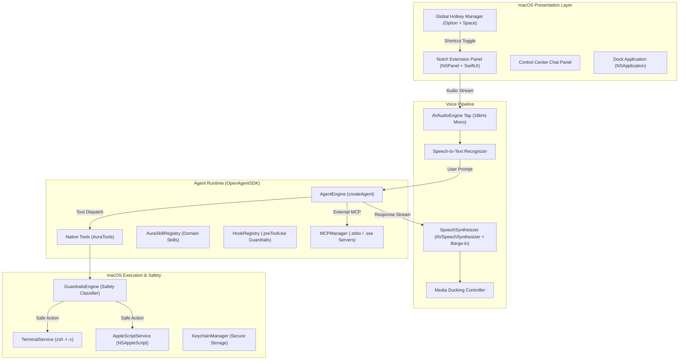

# Aura ⚡️
### Autonomous Voice & Desktop AI Assistant for macOS

Aura is a native, voice-enabled desktop AI assistant for macOS that lives in your Dock, expands fluidly from the MacBook camera notch, and executes real system operations using **[OpenAgentSDK](https://github.com/terryso/open-agent-sdk-swift)**.

---

## Key Features

- **Fluid MacBook Notch HUD**: Dynamically wraps around the physical camera notch with spring animations, auto-expanding to display tool outputs, system metrics, and response cards.
- **In-Process Agent Runtime**: Powered by `OpenAgentSDK` with native Swift 6 concurrency (`async`/`await`, `AsyncStream`), multi-turn context retention, and zero external runtime dependencies.
- **Native macOS Tools**:
  - `open_application`: Launches installed macOS apps via AppleScript and system dispatch.
  - `adjust_volume`: Native audio output control (up, down, mute, unmute).
  - `take_screenshot`: Desktop captures directly to PNG.
  - `list_files`: Fast folder and filesystem inspection.
  - `execute_terminal_command`: Safe shell command execution in `zsh`.
  - `search_emails` & `query_notion`: Workspace connectors for Gmail and Notion.
- **First-Class Model Context Protocol (MCP)**: Mount external MCP servers over `stdio` and `SSE` directly into the agent's tool pool.
- **Proactive Safety Guardrails**: Built-in inspection engine that classifies shell commands and blocks destructive operations (`rm -rf`, `sudo`, `kill -9`) before execution.
- **Voice Pipeline**: Real-time microphone input tap with RMS metering, speech recognition, and instant barge-in speech synthesis with automatic media ducking for Apple Music and Spotify.

---

## Architecture



---

## Prerequisites

- **macOS**: 14.0 (Sonoma) or newer (Apple Silicon & Intel)
- **Swift**: 6.0 or newer / Xcode 16+
- **LLM API Key**: Google Gemini API key or OpenAI API key (configured in App Settings or via environment variables).

---

## Quick Start

### 1. Clone the Repository
```bash
git clone https://github.com/TheShahnawaaz/Aura.git
cd Aura
```

### 2. Build and Package
To build an incremental development bundle:
```bash
./Scripts/bundle_app.sh debug
```

To build an optimized production release bundle and package a distributable DMG:
```bash
./Scripts/create_dmg.sh release
```

### 3. Version Management
To bump the application version and automatically sync `VERSION`, `Info.plist`, `AuraVersion.swift`, and `web/package.json`:
```bash
./Scripts/bump_version.sh <new_version|patch|minor|major>
```

### 4. Run Aura
```bash
open build/Aura.app
```

---

## Configuration & Credentials

You can configure your AI provider either inside **Aura Settings** (`Cmd + ,`) or by exporting environment variables:

| Variable | Description |
| :--- | :--- |
| `LLM_API_KEY` or `GEMINI_API_KEY` | Google Gemini API key |
| `OPENAI_API_KEY` | OpenAI API key |
| `ANTHROPIC_API_KEY` | Anthropic Claude API key |
| `LLM_BASE_URL` | Custom OpenAI-compatible endpoint URL |
| `LLM_MODEL` | Custom model identifier |

---

## Running Tests

Aura includes comprehensive unit test suites covering the agent engine, native tools, skill registry, MCP bridging, guardrails, and Notch geometry:

```bash
swift test
```

---

## Contributing

Contributions are welcome! Please open an issue or submit a pull request for improvements, additional native tools, or community MCP connectors.

---

## License

This project is licensed under the terms of the **[MIT License](LICENSE)**.
